```{r}
#| label: setup
#| include: false
source("scripts.R")
```

## About Me {.center style="font-size: 30px; line-height: 1.5;"}

::: {.columns}
::: {.column width="38%"}

:::

::: {.column width="62%"}
- **Pingfan Hu**, PhD Candidate at George Washington University, advised by Dr John Helveston.

- Research field:
  <div style="margin-left: 1em; line-height: 1;">
    1. Sustainable transportation
    2. Human behavior and decision-making
  </div>

- Research focuses:
  <div style="margin-left: 1em; line-height: 1;">
    1. Open-source software development
    2. Data science and choice modeling
  </div>

- For more infomation, visit [**pingfanhu.com**](http://pingfanhu.com)
:::
:::

## {.light-centered .center}

{fig-align="center" width="85%" .purple-border}

## WYSIWYG Interface {.light-centered .center}

<iframe src="figs/surveydown-wysiwyg-problem.html" style="width:100%; height:500px; border:none;"></iframe>

## {.dark-centered .center}

::: {.column width="40%"}

<br>
<br>

### Why not make surveys from `code`? 

:::

::: {.column width="10%"}
:::

::: {.column .fragment style="width: 40%; text-align: left;"}

### ~~Limitations~~<br>Features

✅ Reproducibility

✅ Version control

✅ Lots of features

✅ Open source

:::

## Introducing `surveydown`! {.dark-centered .center style="font-size: 1.2em;"}

<br>

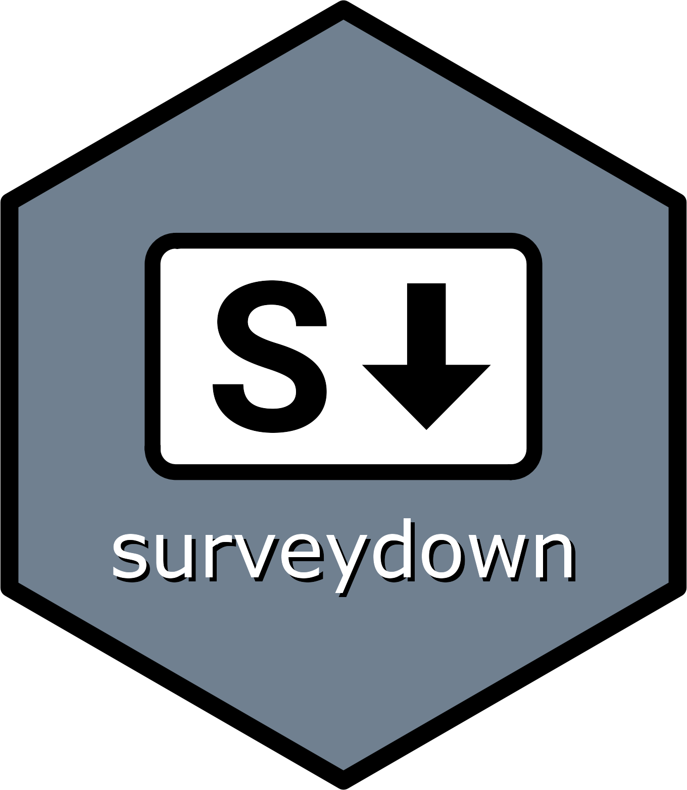{fig-align="center" width=300}

## R package that renders [Quarto]{.teal} files into [surveys]{.teal} {.light-centered .center}

<br>

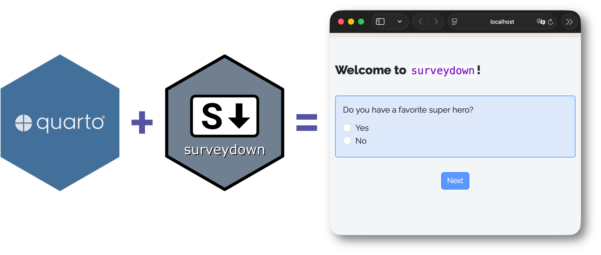{fig-align="center" width=100%}

## {style="font-size: 0.7em;"}

::: {.column width="48%"}

### `survey.qmd` {style="text-align: center;"}

```{r}
#| results: 'asis'
surveycode()
```

:::

::: {.column width="4%"}
:::

::: {.column width="48%"}

### Rendered Survey {style="text-align: center;"}

<br>

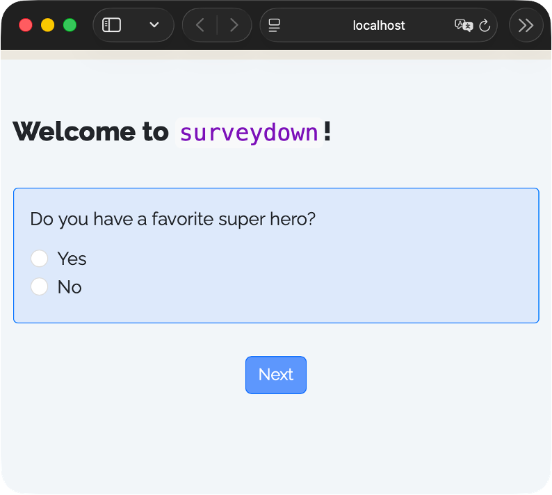{fig-align="center" width=600}

:::

## {style="font-size: 0.7em;"}

::: {.column width="48%"}

### `survey.qmd` {style="text-align: center;"}

```{r}
#| results: 'asis'
surveycode("1-5")
```

:::

::: {.column width="4%"}
:::

::: {.column width="48%"}

::: {.bubble-left style="display: block; transform: none; top: 10%;"}
YAML header for survey settings
:::

:::

## {style="font-size: 0.7em;"}

::: {.column width="48%"}

### `survey.qmd` {style="text-align: center;"}

```{r}
#| results: 'asis'
surveycode("7-9")
```

:::

::: {.column width="4%"}
:::

::: {.column width="48%"}

::: {.bubble-left style="display: block; transform: none; top: 25%;"}
Load the `surveydown` Package
:::

:::

## {style="font-size: 0.7em;"}

::: {.column width="48%"}

### `survey.qmd` {style="text-align: center;"}

```{r}
#| results: 'asis'
surveycode("11,27")
```

:::

::: {.column width="4%"}
:::

::: {.column width="48%"}

::: {.bubble-left style="display: block; transform: none; top: 32%;"}
Use triple-dash marker (`---`)

to define survey pages
:::

:::

## {style="font-size: 0.7em;"}

::: {.column width="48%"}

### `survey.qmd` {style="text-align: center;"}

```{r}
#| results: 'asis'
surveycode("13-25")
```

:::

::: {.column width="4%"}
:::

::: {.column width="48%"}

::: {.bubble-left style="display: block; transform: none; top: 45%;"}
Page content

- Markdown for texts, images, etc.
- `sd_question()` for survey questions
- Auto navigation
:::

:::

## {style="font-size: 0.7em;"}

::: {.column width="48%"}

### `survey.qmd` {style="text-align: center;"}

```{r}
#| results: 'asis'
surveycode()
```

:::

::: {.column width="4%"}
:::

::: {.column width="48%"}

### Rendered Survey {style="text-align: center;"}

<br>

{fig-align="center" width=600}

:::

## [Shiny]{.sage} makes pages interactive {.light-centered .center}

<br>

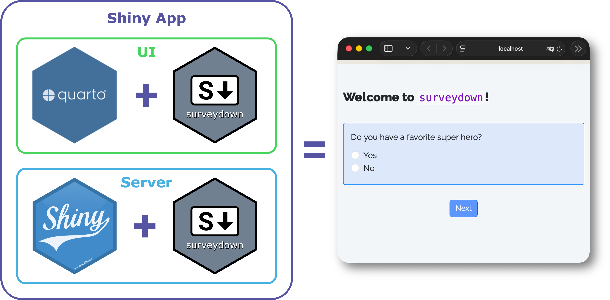{width=100%}

## {style="font-size: 0.9em;"}

::: {.column width="60%"}

### `app.R` {style="text-align: center;"}

<br>

```{r}
#| results: 'asis'
appcode_short()
```

:::

## {style="font-size: 1em;"}

::: {.column style="width: 60%; font-size: 0.9em;"}

### `app.R` {style="text-align: center;"}

<br>

```{r}
#| results: 'asis'
appcode_short("3,7")
```

:::

::: {.column width="4%"}
:::

::: {.column style="width: 36%; font-size: 0.7em;"}

::: {.bubble-left style="display: block; transform: none; top: 22%;"}
Render `survey.qmd` as UI
:::

::: {.bubble-left style="display: block; transform: none; top: 37%;"}
Run the `surveydown` server
:::

:::

## A complete `surveydown` survey {.dark-centered .center}

<iframe src="figs/surveydown-component.html" style="width:100%; height:440px; border:none;"></iframe>

## What is `surveydown`? {.dark-centered .center style="font-size: 1.2em;"}

<br>

{fig-align="center" width=300}

## {.light-centered .center}

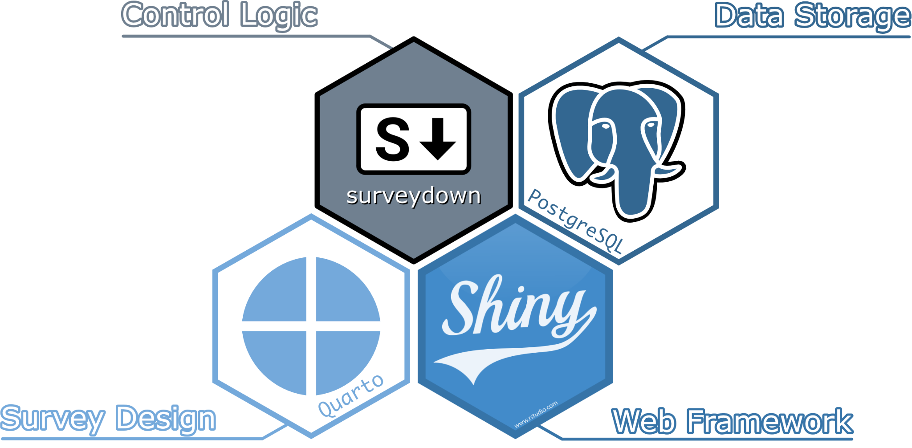{fig-align="center" width=100%}

## `surveydown` Features {.dark-centered .center}

<iframe src="figs/surveydown-features.html" style="width:100%; height:340px; border:none;"></iframe>

## But... {.light-centered .center}

<iframe src="figs/surveydown-problems.html" style="width:100%; height:300px; border:none;"></iframe>

## Introducing `sdstudio`! {.dark-centered .center style="font-size: 1.2em;"}

<br>

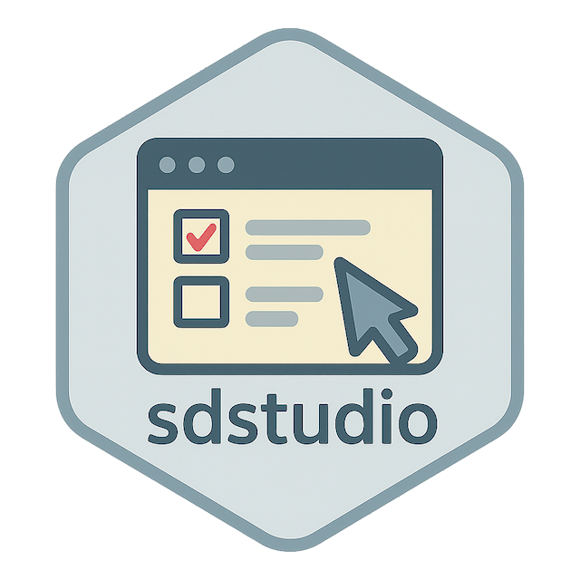{fig-align="center" width=350}

## [Studio]{.amber} Workflow {.dark-centered .center}

<iframe src="figs/studio-workflow.html" style="width:100%; height:420px; border:none;"></iframe>

## Launch with a simple command {.light-centered .center}
<br>

::: {.centered-container style="width: 500px;"}
`sdstudio::launch()`
:::

## [Landing]{.amber} Page {.dark-centered .center}

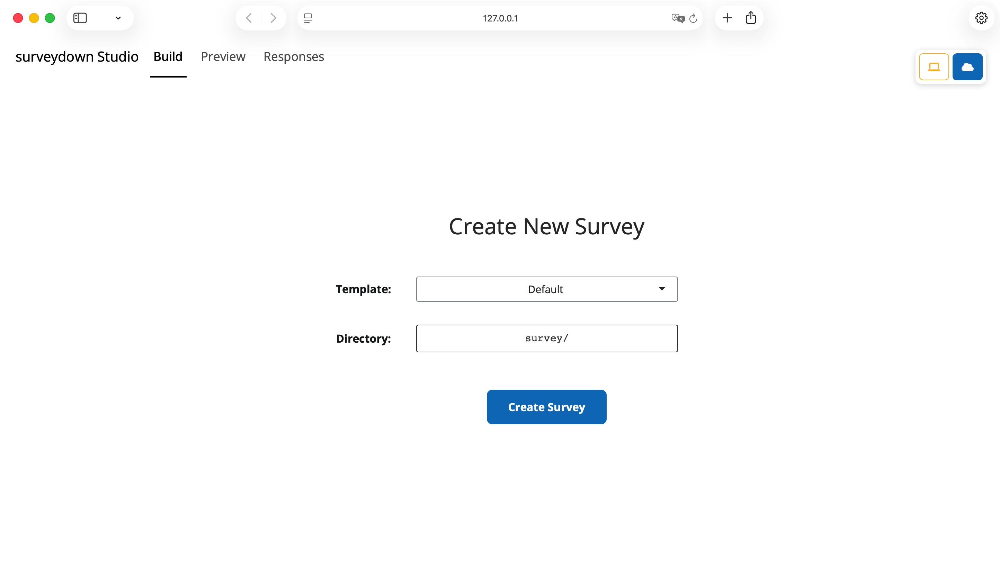{fig-align="center" width=100%}

## Start with a [Template]{.amber} {.dark-centered .center}

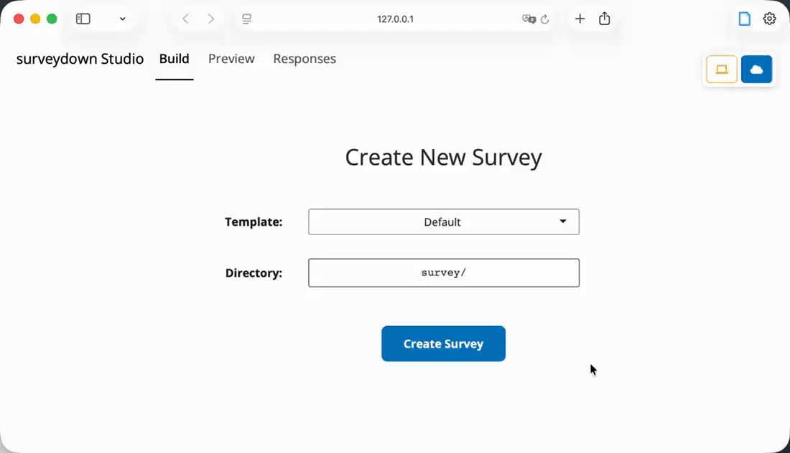{fig-align="center" width=100%}

## [surveydown.org/templates](https://surveydown.org/templates) {.light-centered .center}

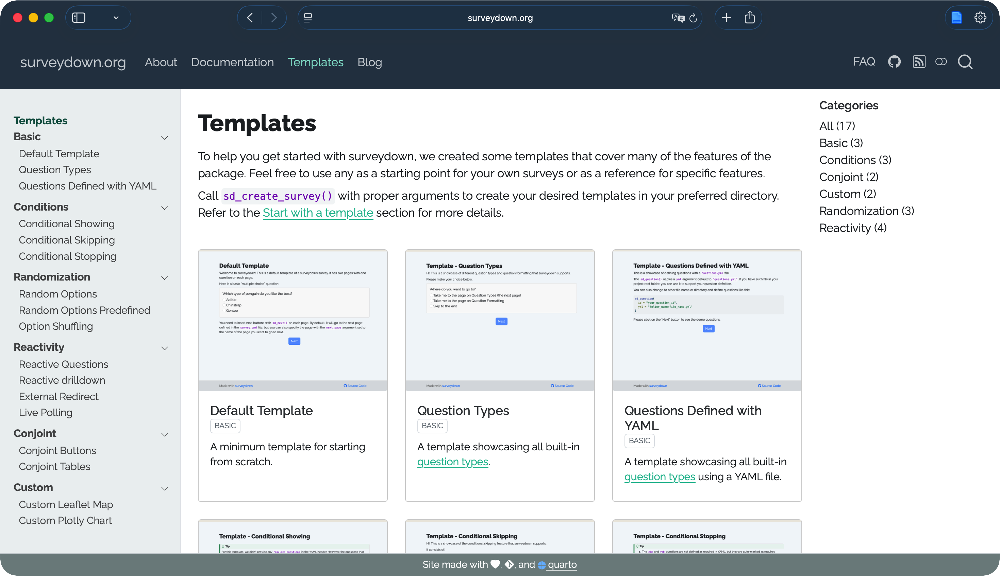{fig-align="center" width=100%}

## Choose Your [Directory]{.amber} {.dark-centered .center}

{fig-align="center" width=100%}

## The [Build]{.amber} Tab {.dark-centered .center}

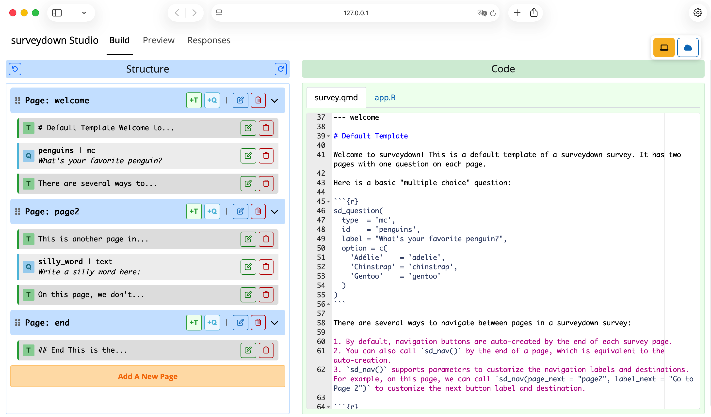{fig-align="center" width=100%}

## The [Preview]{.amber} Tab {.dark-centered .center}

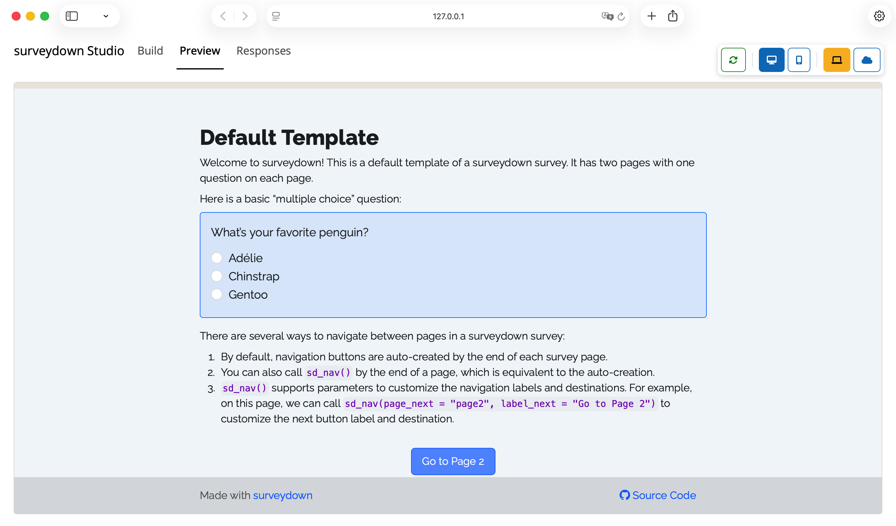{fig-align="center" width=100%}

## The [Responses]{.amber} Tab {.dark-centered .center}

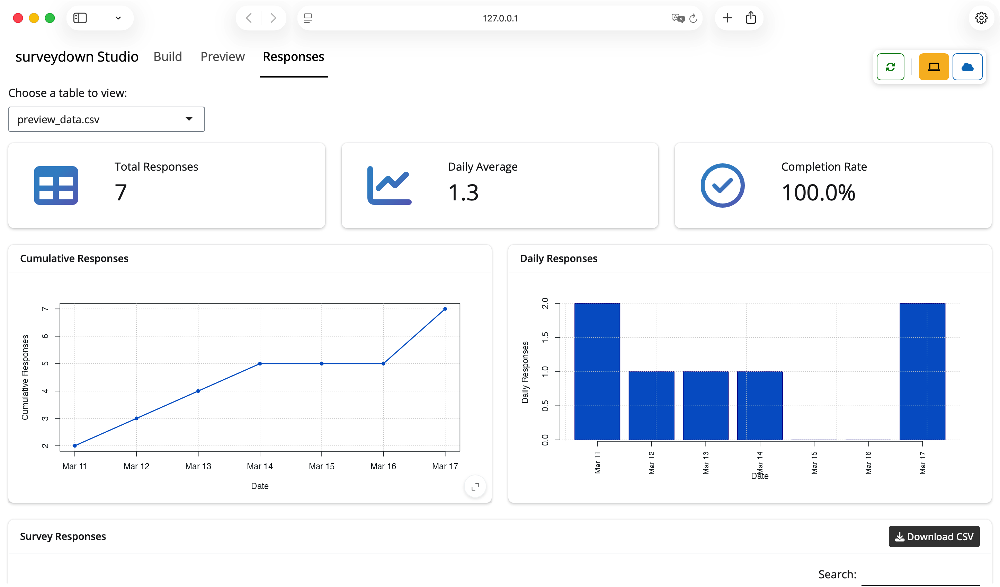{fig-align="center" width=100%}

## The [Responses]{.amber} Tab - Continued {.dark-centered .center}

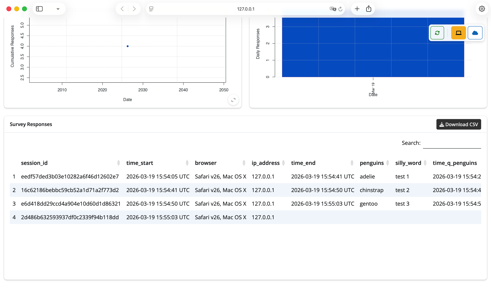{fig-align="center" width=100%}

## [Studio]{.amber} Features {.light-centered .center style="font-size: 1.2em;"}

## Self-explaining Icons {.dark-centered .center}

<iframe src="figs/studio-icons.html" style="width:100%; height:280px; border:none;"></iframe>

## Editing {.light-centered .center style="font-size: 1.2em;"}

<iframe src="figs/studio-editing.html" style="width:100%; height:280px; border:none;"></iframe>

## [GUI]{.amber} - Toggling {.dark-centered .center}

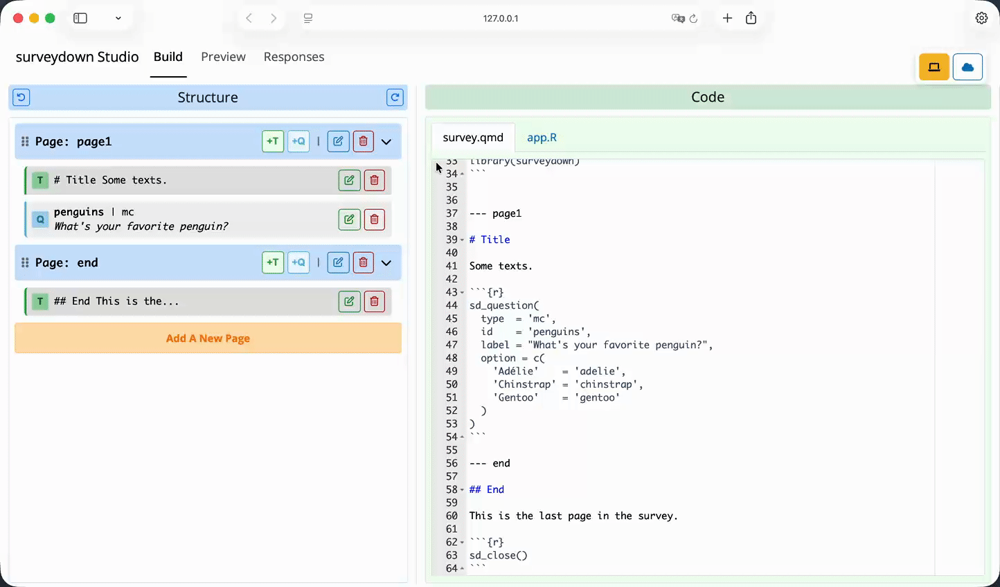{fig-align="center" width=100%}

## [GUI]{.amber} - Content Editing {.dark-centered .center}

{fig-align="center" width=100%}

## [GUI]{.amber} - Content Addition {.dark-centered .center}

{fig-align="center" width=100%}

## [GUI]{.amber} - Page Addition {.dark-centered .center}

{fig-align="center" width=100%}

## [GUI]{.amber} - Page Relocation {.dark-centered .center}

{fig-align="center" width=100%}

## [GUI]{.amber} - Content Relocation {.dark-centered .center}

{fig-align="center" width=100%}

## [Script]{.amber} Editing {.dark-centered .center}

{fig-align="center" width=100%}

## Instant Preview {.dark-centered .center}

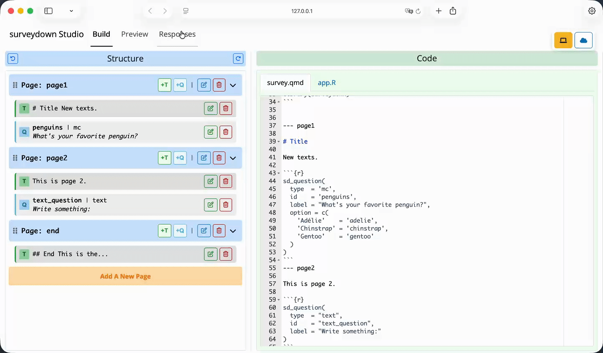{fig-align="center" width=100%}

## Views {.light-centered .center style="font-size: 1.2em;"}

<iframe src="figs/studio-views.html" style="width:100%; height:280px; border:none;"></iframe>

## Desktop and Mobile [Views]{.amber} {.dark-centered .center}

{fig-align="center" width=100%}

## Responses {.light-centered .center style="font-size: 1.2em;"}

<iframe src="figs/studio-responses.html" style="width:100%; height:280px; border:none;"></iframe>

## Local [Responses]{.amber} {.dark-centered .center}

{fig-align="center" width=100%}

## Database [Responses]{.amber} {.dark-centered .center}

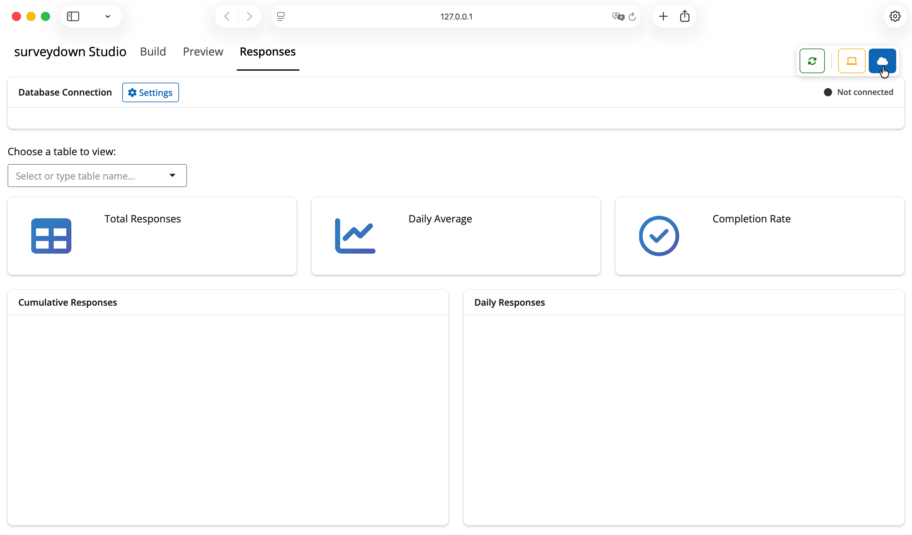{fig-align="center" width=100%}

## Database [Responses]{.amber} {.dark-centered .center}

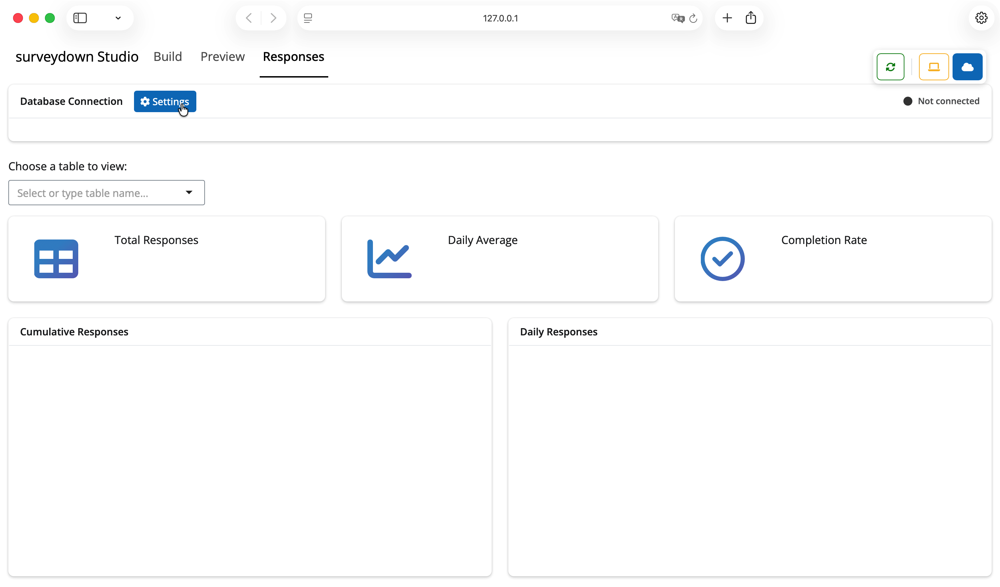{fig-align="center" width=100%}

## Database [Responses]{.amber} {.dark-centered .center}

{fig-align="center" width=100%}

## Database [Responses]{.amber} {.dark-centered .center}

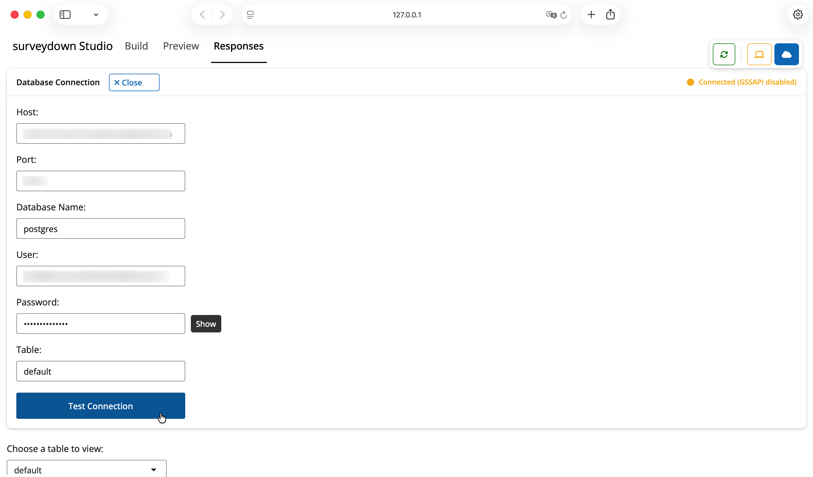{fig-align="center" width=100%}

## Database [Responses]{.amber} {.dark-centered .center}

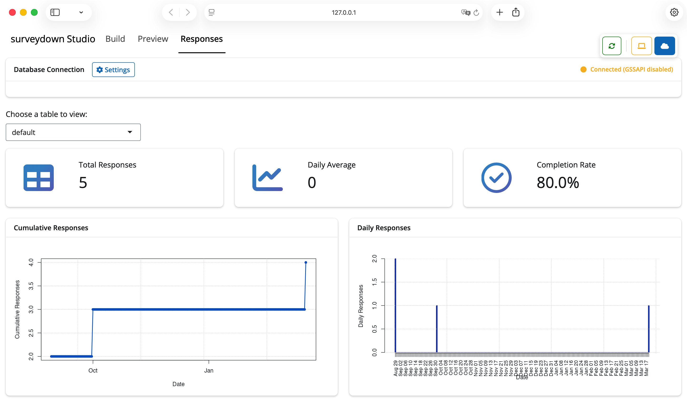{fig-align="center" width=100%}

## `sdstudio` gives you... {.light-centered .center}

<iframe src="figs/studio-summary.html" style="width:100%; height:420px; border:none;"></iframe>

## [surveydown]{.teal} + [sdstudio]{.amber} {.dark-centered .center}

<iframe src="figs/studio-closing.html" style="width:100%; height:520px; border:none;"></iframe>

## Ways to help: {.light-centered .center}

<br>

::: {.centered-container style="width: 85%;"}
[github.com/surveydown-dev/sdstudio/](https://github.com/surveydown-dev/sdstudio/)
:::

<br>

::: {.column style="width: 60; text-align: left;"}

- Try it out!
- Give it a ⭐
- Post an issue
- Join the GitHub discussion
- Contribute new features

:::

::: {.column width="40%"}
{fig-align="center" width=70% .purple-border}
:::

## {.dark-centered .center}

::: {.column style="width: 59%; text-align: left;"}

### Meet the team! {style="font-size: 1.5em; text-align: left; padding-left: calc(20%);"}

::: {.img-middle}
[{width="25%" .round-image .purple-border}](https://www.jhelvy.com) John Helveston, Ph.D.
:::

::: {.img-middle}
[{width="25%" .round-image .purple-border}](https://pingfanhu.com) Pingfan Hu
:::

::: {.img-middle}
[{width="25%" .round-image .purple-border}](https://www.linkedin.com/in/bogdanbt/) Bogdan Bunea
:::

:::

::: {.column width="2%"}
:::

::: {.column width="39%"}

::: {.centered-container style="width: 80%;"}
[**surveydown.org**](https://surveydown.org)
:::

<br>
<br>

{fig-align="center" width=80% .purple-border}

:::
