```{r}
#| label: setup
#| include: false
source("scripts.R")
```

## About Me {.light-centered .center style="font-size: 30px; line-height: 1.5;"}

::: {.columns}
::: {.column width="34%"}

:::

::: {.column width="66%"}
- **Pingfan Hu**, PhD Candidate at George Washington University, advised by Dr. John Helveston.

- Research interests:
  <div style="margin-left: 1em; line-height: 1;">
    1. **Data Science** in sustainable transportation and human behavior
    2. **Open-Source Software** in <svg xmlns="http://www.w3.org/2000/svg" viewBox="0 0 581 512" aria-label="R" style="height: 0.85em; vertical-align: -0.1em; fill: currentColor;"><!-- Font Awesome Free r-project icon (CC BY 4.0) --><path d="M581 226.6C581 119.1 450.9 32 290.5 32S0 119.1 0 226.6C0 322.4 103.3 402 239.4 418.1V480h99.1v-61.5c24.3-2.7 47.6-7.4 69.4-13.9L448 480h112l-67.4-113.7c54.5-35.4 88.4-84.9 88.4-139.7zm-466.8 14.5c0-73.5 98.9-133 220.8-133s211.9 40.7 211.9 133c0 50.1-26.5 85-70.3 106.4-2.4-1.6-4.7-2.9-6.4-3.7-10.2-5.2-27.8-10.5-27.8-10.5s86.6-6.4 86.6-92.7-90.6-87.9-90.6-87.9h-199V361c-74.1-21.5-125.2-67.1-125.2-119.9zm225.1 38.3v-55.6c57.8 0 87.8-6.8 87.8 27.3 0 36.5-38.2 28.3-87.8 28.3zm-.9 72.5H365c10.8 0 18.9 11.7 24 19.2-16.1 1.9-33 2.8-50.6 2.9v-22.1z"/></svg> tools for survey research
    3. **Agentic AI Engineering** around Claude Code
  </div>

- For more information, visit [**pingfan.org**](https://pingfan.org)
:::
:::

## {.light-centered .center}

{fig-align="center" width="85%" .purple-border}

## WYSIWYG Interface {.light-centered .center}

<iframe src="figs/surveydown-problem.html" style="width:100%; height:500px; border:none;"></iframe>

## {.dark-centered .center}

::: {.column width="40%"}

<br>
<br>

### Why not make surveys from `code`? 

:::

::: {.column width="10%"}
:::

::: {.column .fragment style="width: 40%; text-align: left;"}

### ~~Limitations~~<br>Features

✅ Reproducibility

✅ Version control

✅ Lots of features

✅ Open source

:::

## Introducing `surveydown`! {.dark-centered .center style="font-size: 1.2em;"}

<br>

{fig-align="center" width=300}

## [Survey]{.teal} design using [Quarto]{.coral} and [Shiny]{.coral} {.light-centered .center}

<br>

<iframe src="figs/surveydown-intro.html" style="width:100%; height:420px; border:none;"></iframe>

## {style="font-size: 0.7em;" .light-centered .center}

::: {.column width="48%"}

### `survey.qmd` {style="text-align: center;"}

```{r}
#| results: 'asis'
surveycode()
```

:::

::: {.column width="4%"}
:::

::: {.column width="48%"}

### Rendered Survey {style="text-align: center;"}

<br>

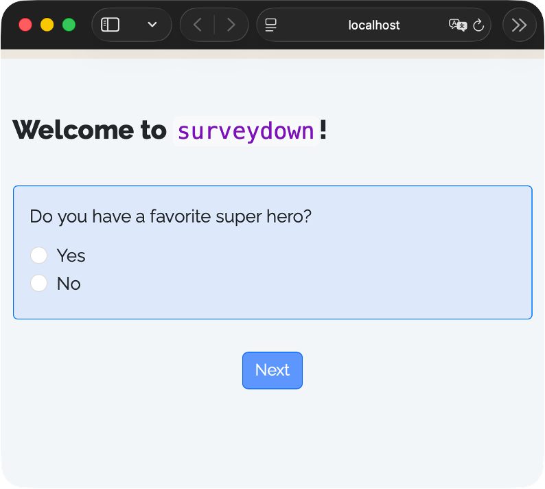{fig-align="center" width=600 .purple-border style="border-radius: 22px;"}

:::

## But... {.dark-centered .center}

<iframe src="figs/surveydown-transition.html" style="width:100%; height:300px; border:none;"></iframe>

## Introducing `sdstudio`! {.dark-centered .center style="font-size: 1.2em;"}

<br>

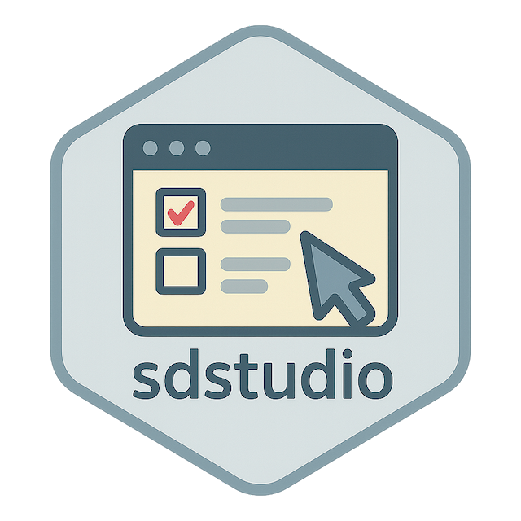{fig-align="center" width=350}

## [Studio]{.amber} Workflow {.dark-centered .center}

<iframe src="figs/studio-workflow.html" style="width:100%; height:420px; border:none;"></iframe>

## Launch with a simple command {.light-centered .center}
<br>

::: {.centered-container style="width: 500px;"}
`sdstudio::launch()`
:::

## [Landing]{.amber} Page {.dark-centered .center}

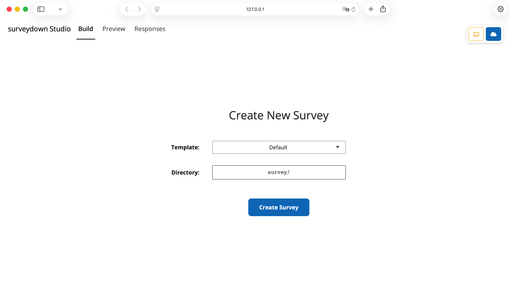{fig-align="center" width=100%}

## Start with a [Template]{.amber} {.dark-centered .center}

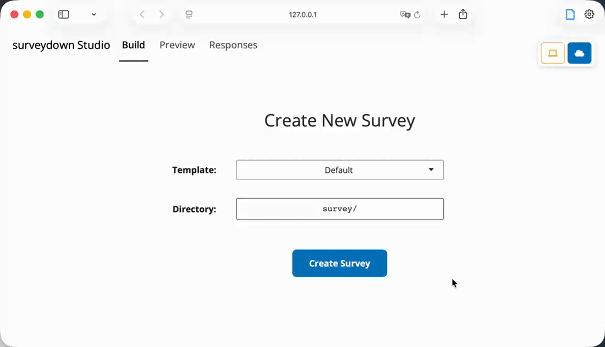{fig-align="center" width=100%}

## [surveydown.org/templates](https://surveydown.org/templates) {.light-centered .center}

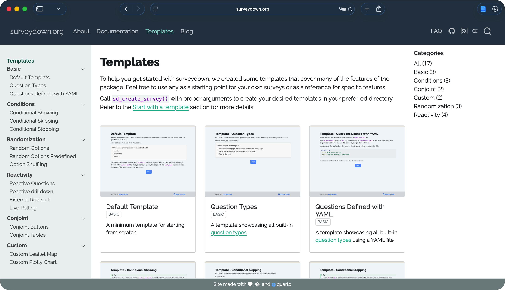{fig-align="center" width=100%}

## Choose Your [Directory]{.amber} {.dark-centered .center}

{fig-align="center" width=100%}

## The [Build]{.amber} Tab {.dark-centered .center}

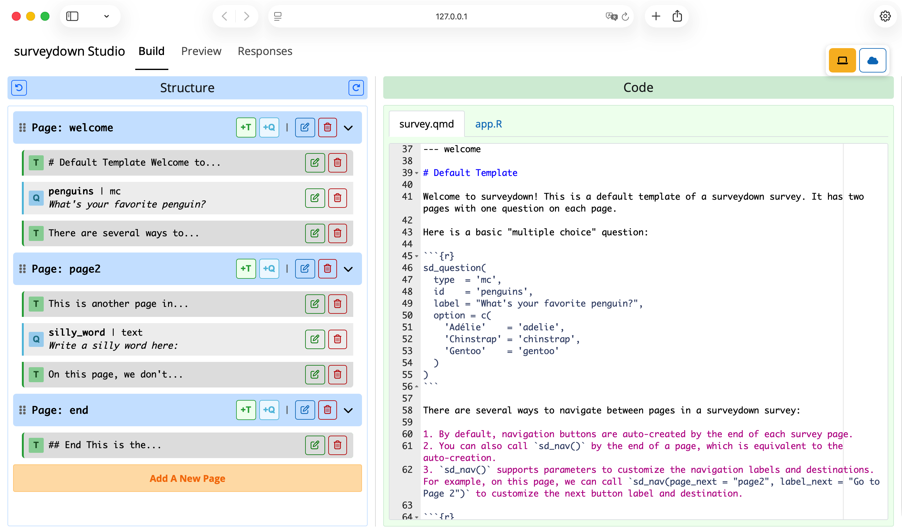{fig-align="center" width=100%}

## The [Preview]{.amber} Tab {.dark-centered .center}

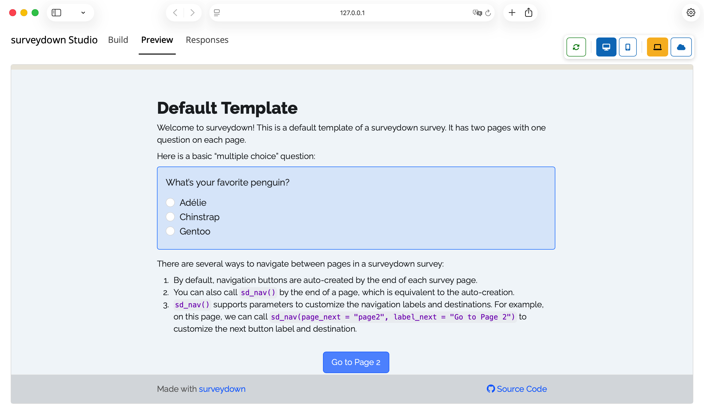{fig-align="center" width=100%}

## The [Responses]{.amber} Tab {.dark-centered .center}

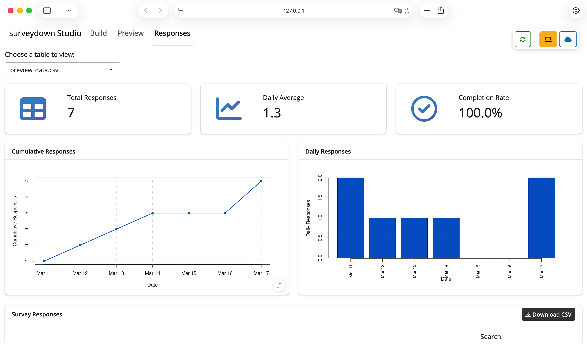{fig-align="center" width=100%}

## The [Responses]{.amber} Tab - Continued {.dark-centered .center}

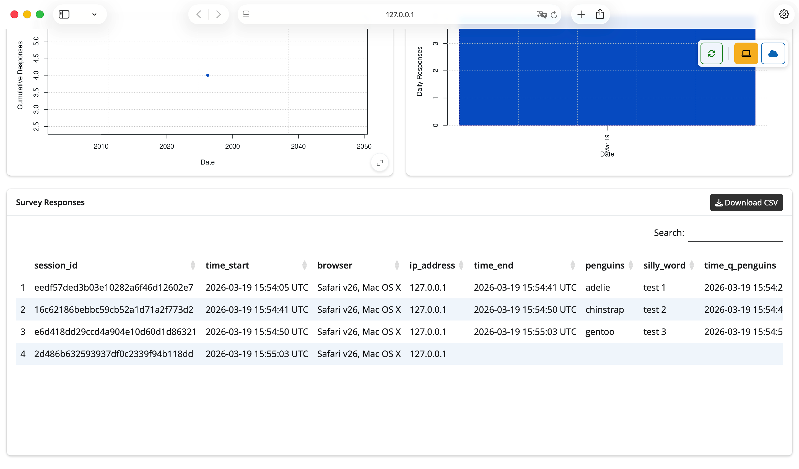{fig-align="center" width=100%}

## [Studio]{.amber} Features {.light-centered .center style="font-size: 1.2em;"}

## Self-explanatory Icons {.dark-centered .center}

<iframe src="figs/studio-icons.html" style="width:100%; height:280px; border:none;"></iframe>

## Editing {.light-centered .center style="font-size: 1.2em;"}

<iframe src="figs/studio-editing.html" style="width:100%; height:280px; border:none;"></iframe>

## [GUI]{.amber} - Toggling {.dark-centered .center}

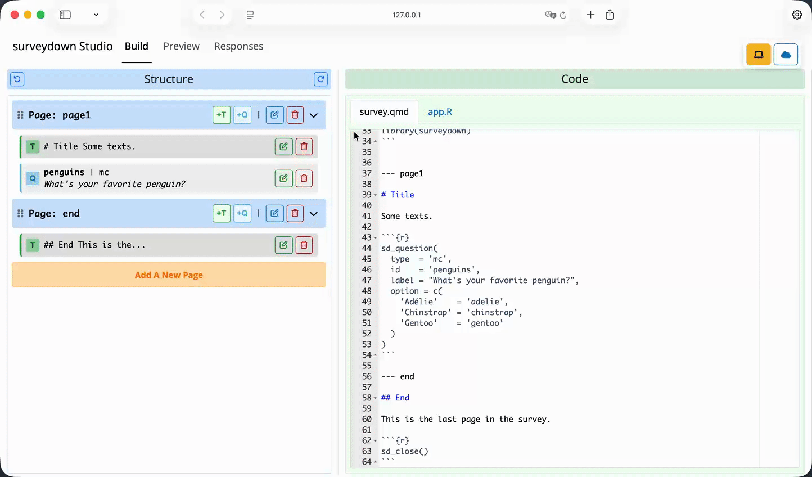{fig-align="center" width=100%}

## [GUI]{.amber} - Content Editing {.dark-centered .center}

{fig-align="center" width=100%}

## [GUI]{.amber} - Content Addition {.dark-centered .center}

{fig-align="center" width=100%}

## [GUI]{.amber} - Page Addition {.dark-centered .center}

{fig-align="center" width=100%}

## [GUI]{.amber} - Page Relocation {.dark-centered .center}

{fig-align="center" width=100%}

## [GUI]{.amber} - Content Relocation {.dark-centered .center}

{fig-align="center" width=100%}

## [Script]{.amber} Editing {.dark-centered .center}

{fig-align="center" width=100%}

## Instant Preview {.dark-centered .center}

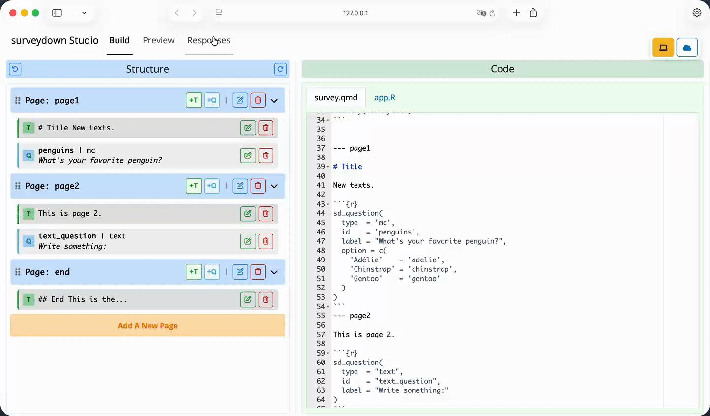{fig-align="center" width=100%}

## Views {.light-centered .center style="font-size: 1.2em;"}

<iframe src="figs/studio-views.html" style="width:100%; height:280px; border:none;"></iframe>

## Desktop and Mobile [Views]{.amber} {.dark-centered .center}

{fig-align="center" width=100%}

## Responses {.light-centered .center style="font-size: 1.2em;"}

<iframe src="figs/studio-responses.html" style="width:100%; height:280px; border:none;"></iframe>

## Local [Responses]{.amber} {.dark-centered .center}

{fig-align="center" width=100%}

## Database [Responses]{.amber} {.dark-centered .center}

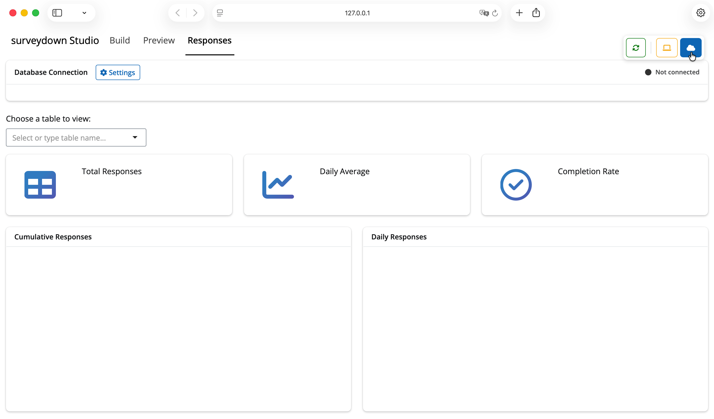{fig-align="center" width=100%}

## Database [Responses]{.amber} {.dark-centered .center}

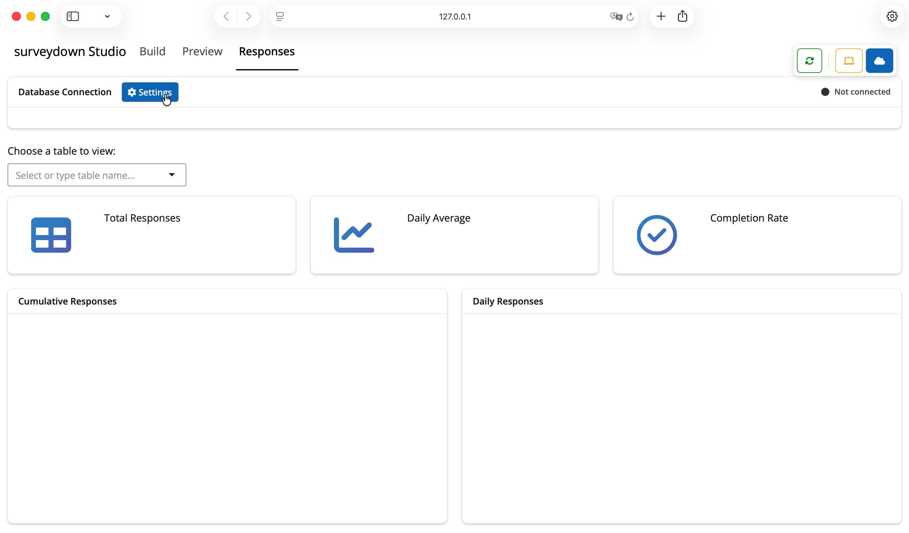{fig-align="center" width=100%}

## Database [Responses]{.amber} {.dark-centered .center}

{fig-align="center" width=100%}

## Database [Responses]{.amber} {.dark-centered .center}

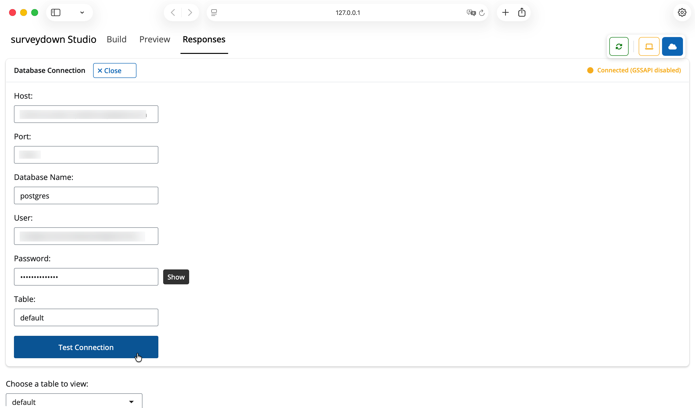{fig-align="center" width=100%}

## Database [Responses]{.amber} {.dark-centered .center}

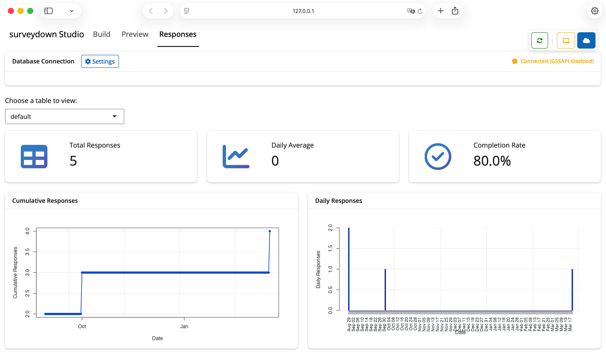{fig-align="center" width=100%}

## `sdstudio` gives you... {.light-centered .center}

<iframe src="figs/studio-summary.html" style="width:100%; height:420px; border:none;"></iframe>

## [surveydown]{.teal} + [sdstudio]{.amber} {.dark-centered .center}

<iframe src="figs/studio-closing.html" style="width:100%; height:520px; border:none;"></iframe>

## Ways to help: {.light-centered .center}

<br>

::: {.centered-container style="width: 85%;"}
[github.com/surveydown-dev/sdstudio/](https://github.com/surveydown-dev/sdstudio/)
:::

<br>

::: {.column style="width: 60; text-align: left;"}

- Try it out!
- Give it a ⭐
- Post an issue
- Join the GitHub discussion
- Contribute new features

:::

::: {.column width="40%"}
{fig-align="center" width=70% .purple-border}
:::

## {.dark-centered .center}

::: {.column style="width: 59%; text-align: left;"}

### Meet the team! {style="font-size: 1.5em; text-align: left; padding-left: calc(20%);"}

::: {.img-middle}
[{width="25%" .round-image .purple-border}](https://www.jhelvy.com) John Helveston, Ph.D.
:::

::: {.img-middle}
[{width="25%" .round-image .purple-border}](https://pingfan.org) Pingfan Hu
:::

::: {.img-middle}
[{width="25%" .round-image .purple-border}](https://www.linkedin.com/in/bogdanbt/) Bogdan Bunea
:::

:::

::: {.column width="2%"}
:::

::: {.column width="39%"}

::: {.centered-container style="width: 80%;"}
[**surveydown.org**](https://surveydown.org)
:::

<br>
<br>

{fig-align="center" width=80% .purple-border}

:::
